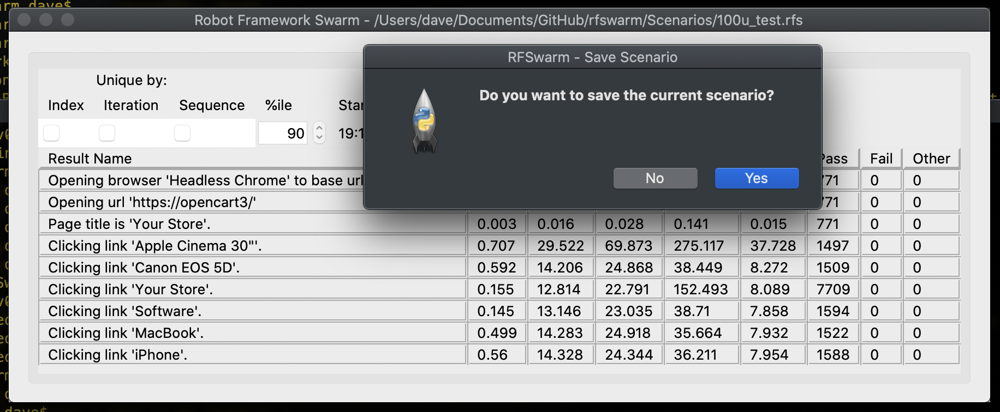

[Index](Index.md)

## Screen Shots

- [v0.5.0](#v0.5.0)
- [v0.4.4](#v0.4.4)
- [v0.4.3](#v0.4.3)
- [v0.4](#v0.4)
- [v0.3](#v0.3)
- [v0.1](#v0.1)
- [Original](#Original)

### v0.5.0

### v0.4.4

### v0.4.3

### v0.4

### v0.3

### v0.1

### Original

