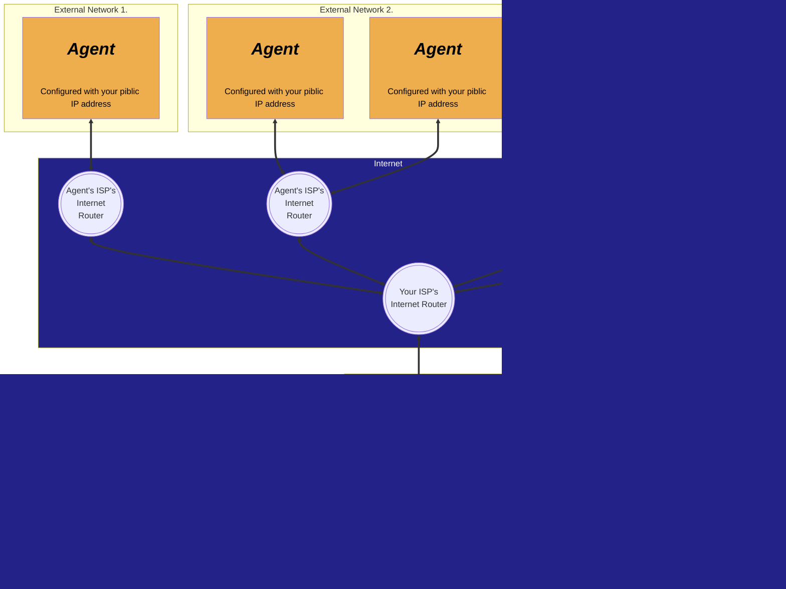
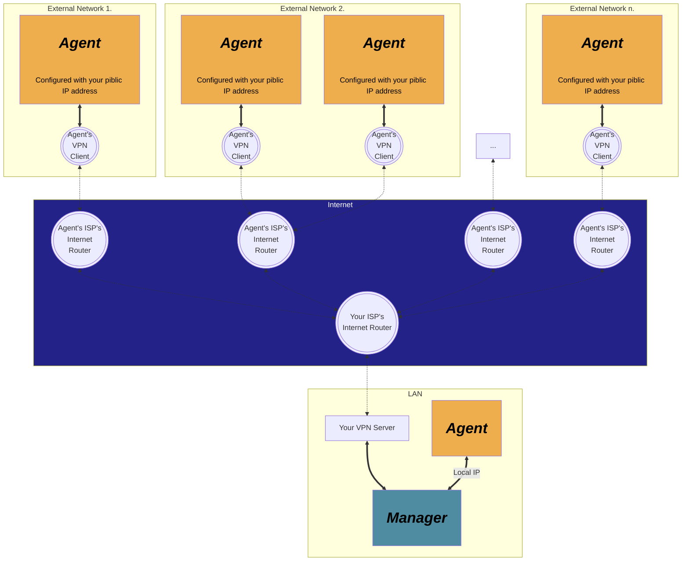
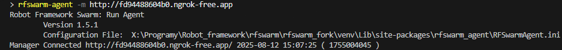
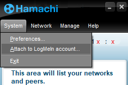
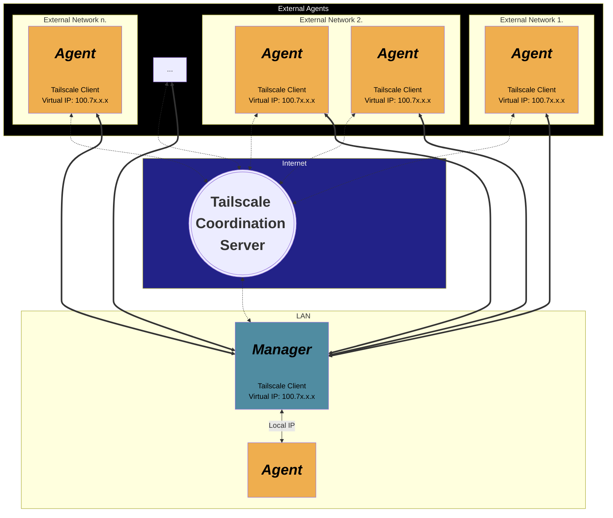

# Optional external network connections
[Return to Index](README.md)

You may already know how to connecting Agent in LAN networks by simply using the Manager IP address with the configured port.
In this case, it is necessary to configure the Agent by specifying only the correct IP address of the Manager and port. This should allow Agent to connect with Manager without any problems if they are located in the same network. \
*For more information follow:* [RFSwarm Agent](rfswarm_agent.md) ("3 Run Agent 1st time")

When we want to use Manager with Agents that are deployed in external networks, the situation becomes a little more complicated.
The Agent and Manager cannot see each other directly and cannot connect using only local IP address. \
This time, we need to enable them to communicate with each other over the **Internet**. \
The Agent communicates with the Manager using HTTP requests, which require knowledge of the Manager's network location.

Such situations may occur, for example, when preparing performance tests and we don't have sufficient computing power.
In this case we may decide to use additional computers  (e.g. at a cloud hosting provider) outside our project environment, where the Manager component is installed.

In such situations, here are some tools that give you the ability to create and control distributed architecture that doesn't have to be located entirely within a single network.

**Methods**:
1. [Port forwarding](#port-forwarding)
2. [VPN](#vpn)
3. [Ngrok](#ngrok)
4. [Hamachi](#hamachi)
5. [Tailscale](#tailscale)

## Port forwarding
Port forwarding is a method that allows you to make an application running on your computer available on the internet.
T use this method, you need to configure your router to redirect traffic from a specific external port (in our case, for example, 8138) on the public IP address provided to you by your ISP to the internal IP address where the Manager and application port are installed (e.g. 192.168.0.10:8138). \
As each router or firewall is different, and we cannot cover all possible models. For information on configuring port forwarding, please refer to your router's documentation.

**General diagram:**


An advantage of using Port forwarding is that you don't need any additional software configuration on your Agents.


## VPN
A VPN from your organisation or your personal VPN can be a secure alternative to port forwarding.
Instead of making the Manager directly available on the internet and exposing yourself to the risks associated with opening router ports, you connect via a virtual private network that creates a secure tunnel between external computers and your internal network.
If you already have a VPN setup this could be a better option, but if not this might be a more complicated to setup initially.

**General diagram:**


An advantage of using a VPN is that your Manager is not directly exposed to the internet and the communication between the Agents and Manager is encrypted over the internet.

## Ngrok
> [Official ngrok site](https://ngrok.com/)

Ngrok is a tool that allows you to create a secure tunnel between a public endpoint that can be connected to via the internet and a locally running network service, which in our case is, of corse, Manager.
Thanks to ngrok, we will communicate with Manager via a special link that will be generated by ngrok application.
In this case all we need to do is install ngrok on the same computer on which Manager is currently running and configure it correctly.

**General diagram:**


A huge advantage of using ngrok is that you don't need to configure port forwarding on your router, which sometimes can be too complicated or even impossible. \
Another advantage of using ngrok is that you only need to install it in the computer where Manager is currently installed.
Agents do not need to have ngrok installed to be able to connect with Manager using a special ngrok link.

### Ngrok Configuration
1. Create an account at [Official ngrok site](https://ngrok.com/)

2. Download the ngrok version for your operating system. (*In the following steps, we will use the Linux version.*)

3. Locate ngrok application. Commonly you can access it with terminal/console by simply typing ngrok but it depends of your installation method.

4. Copy your personal "Authtoken". You can find it on the main site in the section: *Getting Started > Your Authtoken*

5. To activate the ngrok application, you must provide your personal authtoken. This can be done by running the following command:

    ```console
    ngrok config add-authtoken ${your_token}
    ```
    If everything has been done correctly, you should see a message stating that the authtoken has been saved to the configuration file.
    This step only needs to be performed once and can be omitted after restarting machine.

6. Now you can put the Manager online by running the following command:

    ```console
    ngrok http --region=eu 8138
    ```
    * First, we specify the internet protocol that will be used for tunnelling. For us, this should be the http protocol.
    * The `--region=eu` option forces ngrok servers in the European region, but this option is not mandatory although it is recommended.
    You can select different regions, such as: `us, ap, au, sa, jp, in`
    * Finally, we specify the port of our Manager, whose default value is `8318`. If you have configured a different port in the Manager, you must also specify it here.

    For more information on configuration follow: [ngrok documentation](https://ngrok.com/docs/)

7. After executing this command, if everything went well, the terminal window should transform into the **ngrok session window**.

    There you will find *"Session Status"*, which should have the value: `online`.

    

8. Now the URL link is ready and we can see it in the **ngrok session window**. It is located to the right of *"Forwarding"*. Write down the entire link without the arrow and local URL.

9. Launch the Manager application.

10. Write the generated ngrok URL link into the terminal with the -m option:

    ```console
    rfswarm-agent -m http://fd94488604b0.ngrok-free.app
    ```
    or configure it using the Agent configuration file.

    

If everything has been done correctly, the Agent should connect to the Manager and be visible in the Agent tab in the Manager:


Now you can make use of Agent, which is connect to Manager via the internet.
In the terminal where the ngrok session windows is running, you can see the http calls to the Manager made by the Agent. They should have the result code: `200 OK`.


Now you can configure performance tests using Agents that do not need to be on the same network as the Manager.

**Important note:** The ngrok service is free, but the default plan has limited capabilities. So if you want to build a large infrastructure with multiple Agents, you will eventually need to purchase a subscription to get more possibilities and resources.


## Hamachi
> [Official Hamachi site](https://vpn.net/)

Hamachi is a VPN (Virtual Private Network) service by LogMeIn that creates a secure, virtual LAN over the internet.
Hamachi connects multiple devices to the same virtual private network, allowing them to communicate as if they were on the same local network.
It persistent virtual LAN that works well for ongoing peer-to-peer communication without exposing directly to the public internet.

**General diagram:**


In our case, all agents join the same private Hamachi network together with the Manager and communicate with it using a Manager's virtual IP address.

### Hamachi Configuration
1. Create an account on the [Official Hamachi site](https://vpn.net/). Click the "Sign up" button at the top of the home page.

    This step is not required to create a simple virtual network, but we recommend doing so.

2. Download the Hamachi application version for your operating system from the [Official Hamachi site](https://vpn.net/).

    (*In the following steps, we will use the versions for Linux (**Agent**) and Windows (**Manager**)*) \
    We need to install Hamachi application on every device that will act as the Agent or Manager.

3. Locate Hamachi application:

    On Windows, Hamachi is primarily a graphical interface application, but it can be controlled from the command line using scripts and service control.
    We will use the graphical interface.

    On Linux, you can run it in the terminal using the command `sudo hamachi` after installing the appropriate package for your distribution.

4. Set your status to online:

    After launching the Hamachi application in the terminal/application, message should appear stating that your status is offline.

    * In Windows it will be visible in the main application panel. \
        In the main Hamachi application window, click the power button, which is currently greyed out to become online.

    * To start the Hamachi service in Linux computers, we must first execute the following command: `sudo hamachi`. \
        If it returns information such as: *version, pid, status, ...*, it means that the Hamachi service is active.
        If it returns the message: "*Hamachi does not seem to be running.*", continue as instructed after this message to start Hamachi.

        Run `sudo hamachi` again to check if the service has started.

        If the service is running, execute the command: `sudo hamachi login` to become online. After running the command: `sudo hamachi` you should see your: *client ID, address, etc*.

5. Login in to Hamachi using LogMeIn account.

    This is not mandatory for a really simple setup, but we recommend doing so to get a better view and control over the virtual networks and devices.
    * *Windows:* \
        Follow the image:

        

        Complete the panel that appears, send the invitation request.

    * *Linux:* \
        Execute this command: \
        `sudo hamachi attach ${your_email}`
        > You can check all cli commands for Hamachi by typing: `sudo hamachi help`

    \
    Go to this link:
    [LogMeIn central site](https://secure.logmein.com/central/Central.aspx) \
    Next, go to the section: *("Networks" > "My Networks")*

    The invitations you created should appear at the top of the page. Go there and accept them.

6. Private network configuration:

    We will configure it on the same computer where the Manager is installed.
    * *Windows:* \
        Click the "Create a new network" button:

        

        Now you need to complete the personal network configuration. Give it a name and create a password.

        

        After completing these steps, you should see your network, and the number of devices should be 1/5 (*In free Hamachi subscription plan you have limit for 5 devices*).

        **Important Note:** After creating a Hamachi virtual network in Windows, you must disable the Windows firewall for public networks or configure it appropriately for the Hamachi service.

    * *Linux:* \
        When we have a manager on Linux, we can execute this command to create a virtual network: \
        `sudo hamachi create <network id>` and enter the password.


7. Join the private network:

    Once our private network is active on the Manager's computer, we can connect to it from any external network, as long as it has an internet connection.
    >Reminder: Hamachi client must be installed on every Agent.

    * *Windows:* \
        Click "Network" > "Join an exsisting network" to join existing network:

        

    * *Linux:* \
        Run the command: `sudo hamachi join <network id>` and enter the password.
        If everything has been done correctly, the message: "*Joining <network id> .. OK*" should appear.

8. Check if the computer has connected to the virtual network:

    * *Windows* \
        It should be visible on the Hamachi application:

        

    * *Linux:* \
        Run the command `sudo hamachi list` and verify its content.

9. Perform a ping check:

    To check connectivity, ping the Manager's virtual IP address (`ping 25.x.x.x`). At this point, it should be successful.
    If the ping fails, there may be issues with firewalls or other internet traffic restrictions could be enabled.

10. Connect the Agent to the Manager:

    Enter the Manager's virtual IP address with port number in the terminal with the -m option:
    ```console
    rfswarm-agent -m http://25.x.x.x:8138
    ```
    or configure it using the Agent configuration file.

    

If everything has been done correctly, the Agent should connect to the Manager and be visible in the Agent tab in the Manager:


Now you can configure performance tests using Agents that do not need to be on the same local network as the Manager.

**Important note:** The Hamachi service is free, but the default plan has limited capabilities. So if you want to build a large infrastructure with multiple Agents, you will eventually need to purchase a subscription to get more possibilities and resources.

## Tailscale
> [Official Tailscale site](https://tailscale.net/)

Tailscale is something like a Hybrid between a VPN, ngrok and Hamachi, it uses the Tailscale Coordination Server to direct the Tailscale client to another Tailscale client either directly or via one or more relay servers. The Tailscale client then creates a direct encrypted "VPN" connection to the remote Tailscale client, thus the 2 Tailscale clients appear to be in the same subnet.

1. Create an account on the [Official Tailscale site](https://tailscale.com/). Click the "Get Started - It's Free" button at the top of the home page.

2. Download and configure the Tailscale application version for your operating system from the [Official Tailscale site](https://tailscale.com/download/), on the Manager and all your remote agents.

3. From the [Tailscale Machines Page](https://login.tailscale.com/admin/machines), verify your Manager and Agents are showing in the list as Connected, take not of the IP address provided for your Manager machine (100.x.x.x)

4. There is no need to configure a Tailscale exit node as you don't need to use one.

5. Use the Tailscale IP address or Tailscale Machine Name for your Manager machine, configure the Agents Manager URL with this IP / Machine name

**General diagram:**

