[Index](README.md)

## rfswarm Manager

rfswarm Manager is the central server component of rfswarm, this is where you plan, execute and monitor your performance test.

- [User Interface](#User-Interface)
	- [Plan](#Plan)
	- [Run](#Run)
	- [Agents](#Agents)
	- [About](#About)
	- [Graphs](#Graphs)
- [Command Line Interface](#Command-Line-Interface)
- [Install and Setup](#Install-and-Setup)
	- [Install](#1-install)
	- [Adjust the Firewall](#2-Adjust-the-Firewall)
	- [Run the Manager](#3-Run-the-manager)
	- [Manual Install the prerequisites](#4-Manual-Install-the-prerequisites)
	- [Manual Run the Manager](#5-Manual-Run-the-Manager)
- [Agent Assignment](#Agent-Assignment)
- [Credits](#Credits)

### User Interface
#### Plan
This is where you construct your test scenario, choose your test cases and number of virtual users. The interface should be intuitive and simple to understand but still allow fairly complex scenarios to be created.

All the time fields (Delay, Ramp Up & Run) are in Seconds, due to the way the [agent polling](./rfswarm_agent.md#agent-polling-of-the-guiserver) works it's best not to use values less than 10 seconds.

> _Plan - Planning a performance test_ <br>
> 

> _Plan - New_ <br>
> 

> _Plan - Delay example_ <br>
> 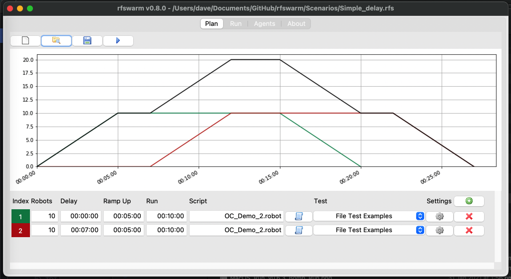

> _Plan - gradual ramp-up example_ <br>
> 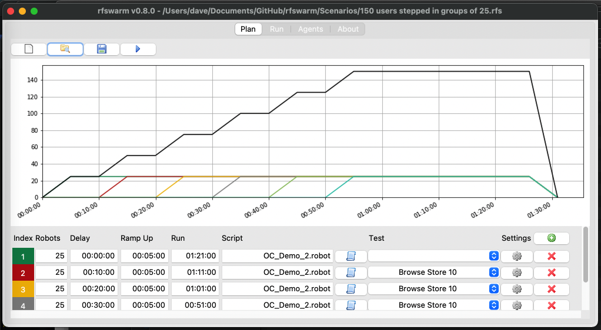

> _Plan - Linux (Ubuntu 20.04)_ <br>
> 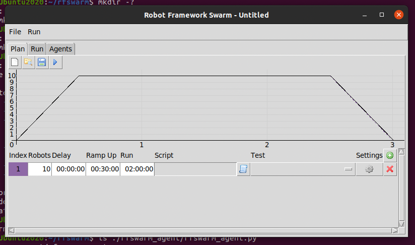

> _Plan - Windows 10_ <br>
> 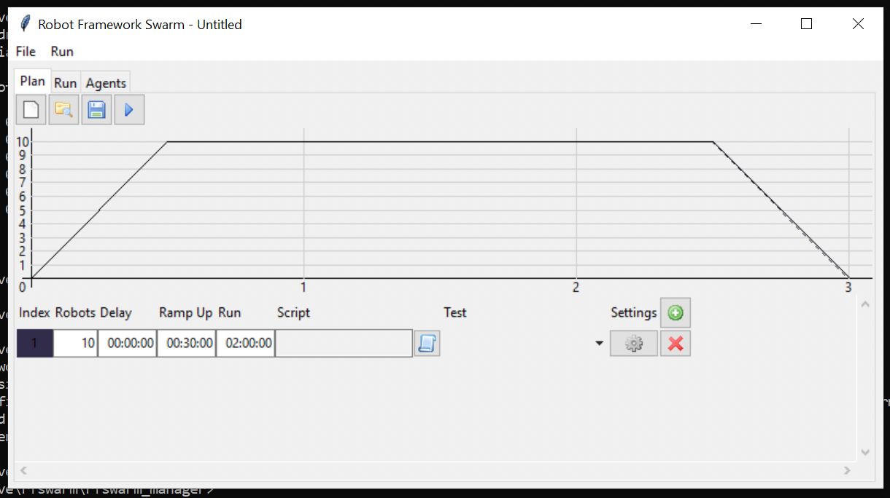

> _Plan - Tests in other languages_ <br>
> 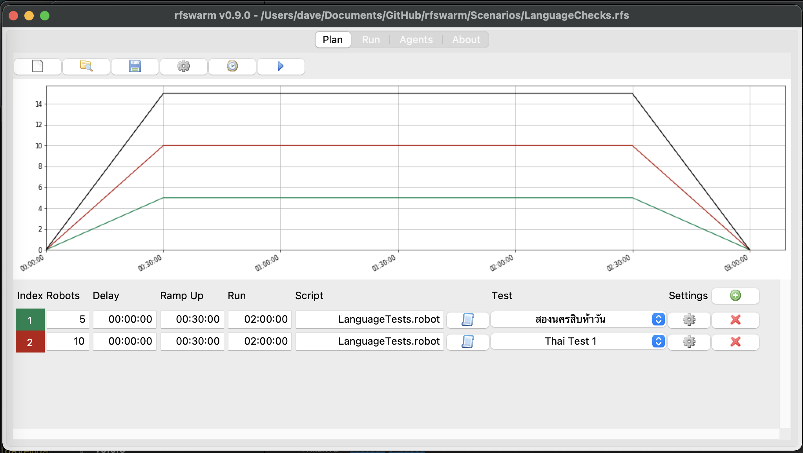

While hopefully this is intuitive, the tool bar buttons are:

|	|	|	|
|---|---|---|
| New	|			| Create a new scenario	|
| Open	|		| Open an existing scenario	|
| Save	|				| Save the current scenario	|
| Settings	|				| Configure additional settings for the current scenario or rfswarm	|
| Schedule	|				| Schedule the test start time	|
| Play	|		| Play the current scenario	|

The test group buttons are:
|	|	|	|
|---|---|---|
| Add	|				| Add another test group	|
| Select |				| Select a robot file	|
| Settings | 			| Configure additional settings for a test group	|
| Remove |				| Remove this test group	|

The columns under the graph
| Column Name	| Detail |
|---		|---	|
| Index		| The test group's line number in the scenario, the background colour matches the line colour in the graph above |
| Robots	| The number of robots (virtual users) you are planning to run in the scenario for this test group |
| Delay		| The amount of time (HH:MM:SS*) to wait before starting Ramp Up |
| Ramp Up	| The amount of time (HH:MM:SS*) to get from 0 virtual users (robots) to the number of virtual users (robots) defined in the Users column |
| Run		| The amount of time (HH:MM:SS*) to keep all the virtual users (robots) defined in the Users column running after Ramp Up has finished. If a robot finishes it's test steps before the end of this time it will be restarted After this time has elapsed the robots will finish their test steps and exit normally (Ramp Down) |
| Script	| This is where you select the robot file that contains the test you want to assign to this test group |
| Test		| This is where you select the test you want to run for this test group, this option list is auto populaed when you select a robot file in the Script column |
| Settings	| This is where you can select additional settings for the test group |

* For Delay, Ramp Up and Run, you can either type the time in HH:MM:SS or just a number of seconds or MM:SS, the plan screen will auto update it to HH:MM:SS. For example if you typed 300 it will update to 00:05:00, 7200 will update to 02:00:00, also if you type 5:30 it will update to 00:05:30.

##### Settings for the scenario and rfswarm 

###### Scenario settings
At the moment there is only one scenario setting, the upload logs setting, this allows you to control when the agent will upload the logs for the test cases being run.
> 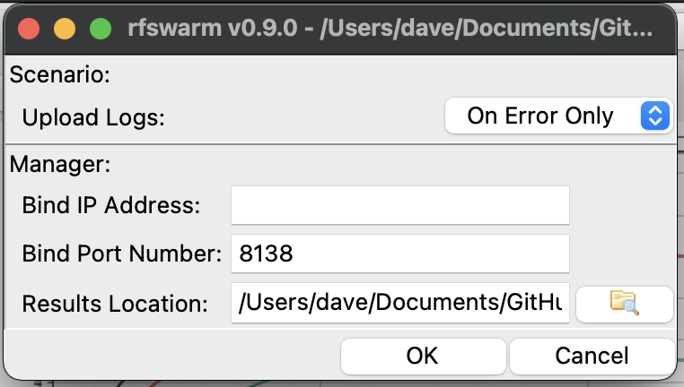
> 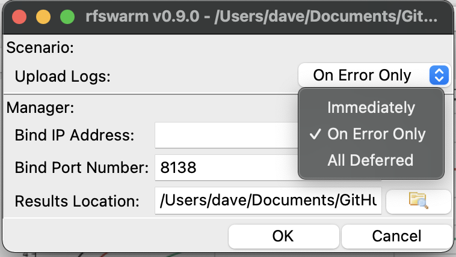

The options are:
| Option | Action |
|---     |---     |
| Immediately | As soon as a test case finishes it will start uploading the logs regardless of test result in parallel to starting the next iteration of that test case |
| On Error Only (default)| As soon as a test case finishes it will start uploading the logs only if the test ended with a fail, result logs for passed tests will be deferred until the last robot has stopped on the agent |
| All Deferred | All test result logs will be deferred until the last robot has stopped on the agent |

* * In earlier releases before v1.0.0 the agent always followed the default case.

###### Manager settings
The manager settings allows you to access settings that were previously only accessable from the ini file
> 

**Bind IP Address**

This setting allows you to restrict the web server that the manager uses to communicate with the agents to a specific ip address. By default this setting is blank so the manager will listen on all IP addresses on the machine the manager is running on.
Generally you should not need to change this setting and it should be left blank unless you know you need to restrict the manager to a specific address.

* * You will need to restart the manager for this setting to take effect.

**Bind Port Number**

The default port that the manager web server uses to communicate with the agents is 8138, however in some cases you may need to change the port number.

* * You will need to restart the manager for this setting to take effect.

**Results Location**

This setting allows you to configure where the manager will save the test results when you run a performance test.


##### Schedule start time 
This feature allows you to schedule the start time for a test, by default it is disabled and if you press the run button the test will start immediately.
> 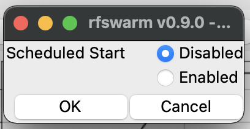

If you enable this setting you can set the time that the test will start, the start time must always be in the future, by default it will be on the same day, but if you enter a time in the past, it will automatically adjust to the next day.
> 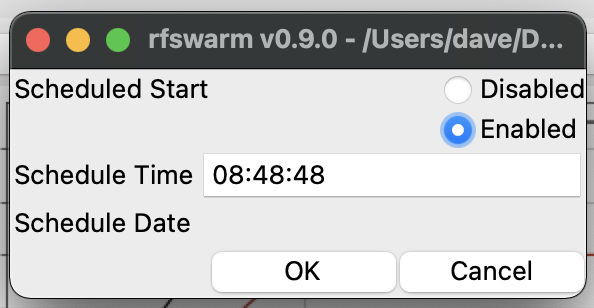

e.g. 1 - if the time now is 11:30 PM and you want your test to start at 1 AM the next day, enter a time of 01:00:00 and tomorrows date will show in the scheduled start date

e.g. 2 - if the time now is 9:05 PM and you planned to start at 9:00 AM, so enter a time of 09:00:00 without realising that was already in the past, the test will not start till 9 AM tomorrow. In this case choose a new start time later today or disable the schedule and just click run.

* * The manager needs to remain running in order for the schedule to work. You cannot schedule a start time and then quit the manager.

##### Additional settings for test group 
When clicking on this button a dialogue will be presented that allows you to configure some additional settings for the test group, by default the dialogue will look like this:
> 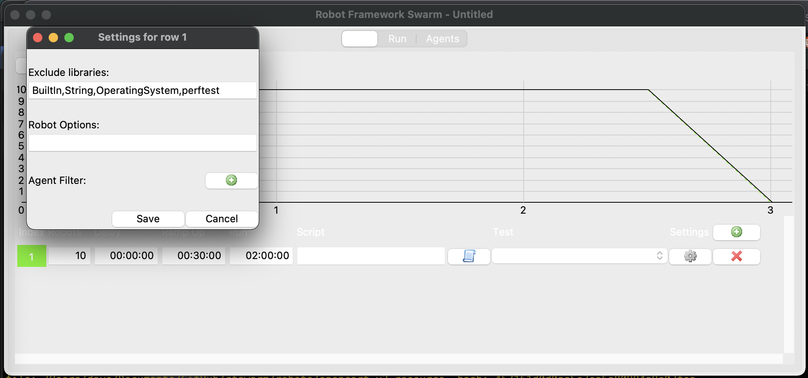

###### Exclude libraries:
The default value is "BuiltIn,String,OperatingSystem,perftest", this is the same default value as used in the [agent settings](./rfswarm_agent.md#exclude-libraries) and if you leave this default but change the agent the settings set on the agent will override this setting.
By configuring this setting you can adjust which keyword's response times are reported in the test results.
If you change this setting here from the default, then for this particular test group the agent setting will be overridden with the settings used here

|agent ini setting|test group setting|result|
|---|---|---|
|default|default|default (BuiltIn,String,OperatingSystem,perftest)|
|configured|default|agent ini setting|
|default|configured|test group setting|
|configured|configured|test group setting|

###### Robot Options:
By default this setting is blank and in most cases wouldn't be used, it allows you to pass additional command line options to the robot executable, to find out what options can be passed run
`robot -h`
On any machine that has Robot Framework installed

###### Agent Filter:
You can use this setting to modify the default [agent assignment](#agent-assignment) to require test cases to require agents with particular properties or to exclude agents with particular properties.

By default there are no Agent filters applied, and the test group can be run on any available agent.

Here are some examples of when you might need this setting:
- Your AUT has a desktop client and a web ui, the tests executed in the desktop client need an agent with Windows os and the web ui scripts can run on any agent that has SeleniumLibrary available
	- on the desktop client scripts you add a filter rule that Requires "OS: System: windows"
	- on the web ui scripts you add a filter rule that Requires "RobotFramework: Library: seleniumlibrary"
- Your AUT has an internal component that can only be accessed by users in your corporate network and an external component that can only be accessed by internet users
	- in your agents ini file you configure a custom property of "Corp Network" or "Internet" depending on which network the agent sits in.
	- on the internal component scripts you add a filter rule that Requires "Corp Network"
	- on the external component scripts you add a filter rule that Requires "Internet" alternatively you could configure a rule that Excludes "Corp Network"

The combination of multiple require and exclude rules, the default and custom agent properties should allow you to have the control needed to target your test groups to specific agent or groups of agents as needed.

Here is an example of configuring the Filter Rules and using the Robot options:
> 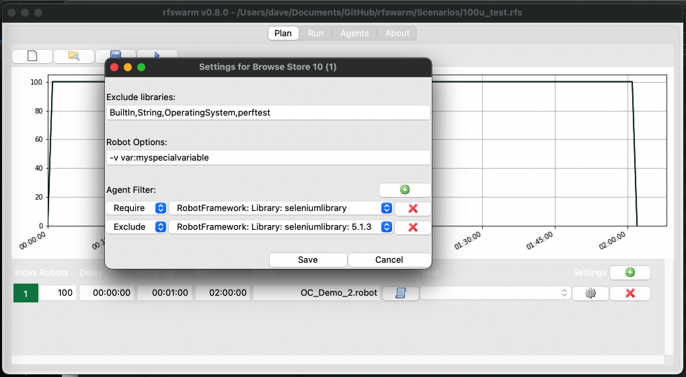


#### Run
This is where you monitor your test scenario as it runs, here you will see number of robots running, how long the has been running and live updates of the test results.

Unique by check boxes:
- Index, use this if multiple test cases have results with the same result name but you want to keep the result timings separated based on the individual test cases.
- Iteration, use this if you want to keep the result timings separated based on the test iteration.
- Sequence, use this if multiple test steps in the same test case have the same result name but you want to keep the result timings separated based on the sequence within the test case.

%ile (Percentile) field:
The default value is 90, you can adjust the percentile value between 1% and 99% depending on your application's performance requirements.

##### Stop button 
Use this if you want to stop the test early. You may not notice an immediate reaction as pressing the button just changes the end time on all the test jobs assigned to the current time and stops the ramp-up if the test is still in the ramp-up phase.

Once the stop button has been pressed the agents will receive the changed end time when they [poll](./rfswarm_agent.md#agent-polling-of-the-guiserver) the Manager next, the agent will change status to stopping which will be returned on the next poll interval and the agent will not start a new iteration for the running tests, however the ones currently running will be allowed to complete.

##### Abort button 
This button replaces the Stop button when either of the following happens:
- You press the Stop button
- The test reaches the ramp-down period after run is complete

Clicking the Abort button will present a warning dialogue like this:
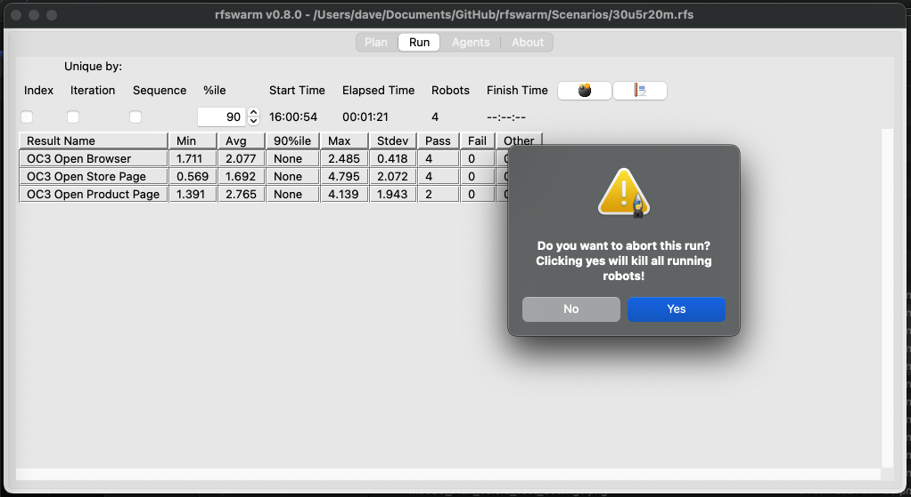
Clicking yes on this dialogue will instruct the agents to send a sigterm (^C) to the running robots causing them to abort the currently running test and execute any teardown steps then exit.
You would normally only use this option if your AUT has crashed and you need to stop applying load to the system.

##### Disabled Stop button 
This button replaces the Stop/Abort buttons when either of the following happens
- You clicked yes to abort the run
- The test completes ramp-down
Clicking this button does nothing.

##### CSV Report button 
Use this to generate csv files suitable for use to create reports for your test run, there will be three files generated:
- A Summary file, this is the same data as on the run screen
- A Raw Results file, the is every data point recorded, useful if you want create response time graphs
- An Agents file, this is all the agent stats recorded, useful if you want to graph running robots or agent loads

> _Run - Just started_ <br>
> 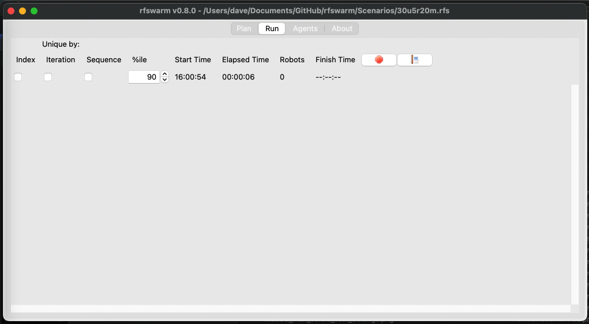

> _Run - Just started, first results coming in_ <br>
> 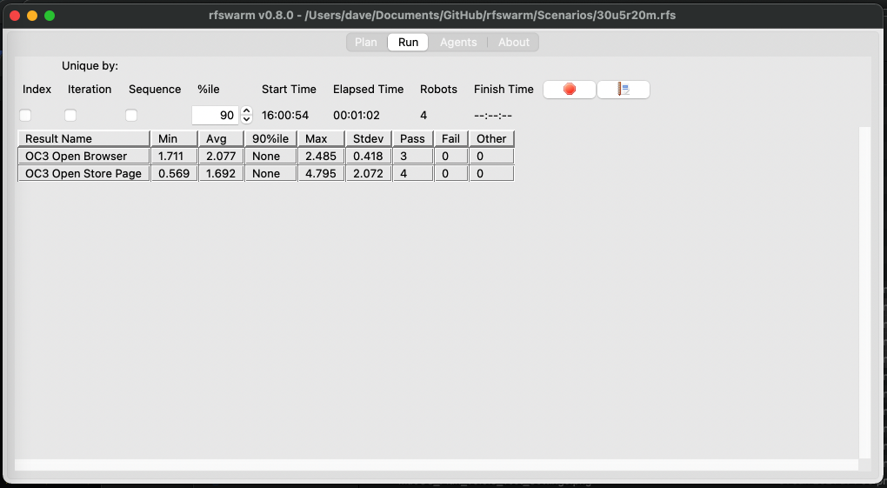

> _Run - Showing results being collected live_ <br>
> 

> _Run - Linux_ <br>
> 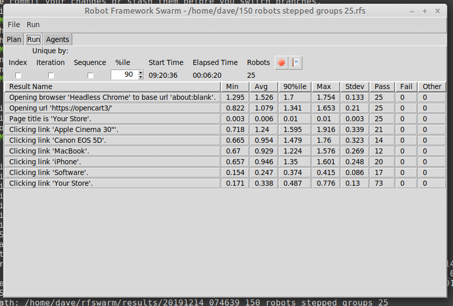

> _Run - Linux Report Saved_ <br>
> 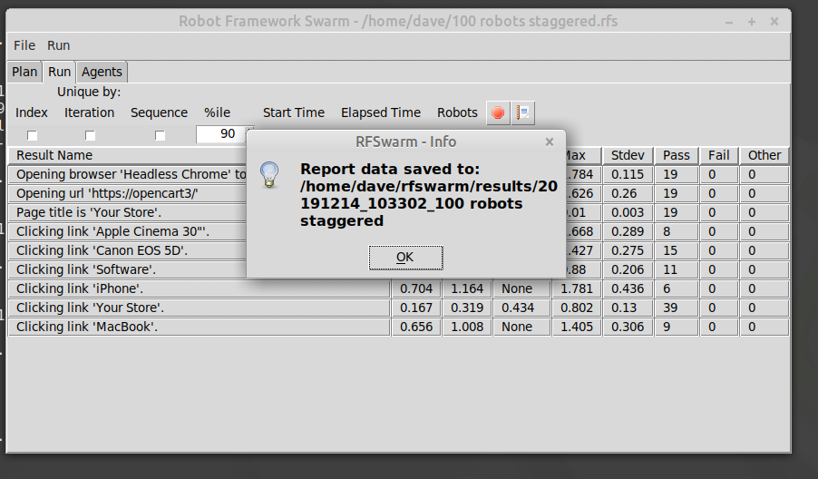


The columns for the run screen
| Column Name	| Detail |
|---		|---	|
| _Index_	| _This optional column indicates the test groups the result came from and matches the test group index from the plan screen_ |
| _Iteration_	| _This optional column indicates iteration the result came from, the first time a robot runs a test on an agent is iteration 1, the next time that same robot runs that test is iteration 2, etc. e.g. in a 1hr test with 50 robots in a test group robot 1 (first robot started in test group) may run 12 iterations but robot 50 (last robot started in test group) may only run 10 iterations of the same test before the end of the run period of the scenario_ |
| _Sequence_	| _This optional column indicates sequence number (autogenerated number) of the test step within the test case_ |
| Result Name	| This is the result name as reported by robot framework, usually this will match either the documentation or full name lines for a test step in a robot framework report |
| Min		| This is the shortest (quickest) response time reported by any robot during the test |
| Avg		| This is the average of all the response time reported by all robots during the test |
| nn%ile	| This is the percentile as configured by the %ile field above the run results. e.g. 90%ile is the response time that 90% of robots reported a response time less than or equal to during the test |
| Max		| This is the longest (slowest) response time reported by any robot during the test |
| Stdev		| This is the [Standard Deviation](https://en.wikipedia.org/wiki/Standard_deviation) of the response times for this result |
| Pass		| This is a count of the number of times a robot reported a pass for this test step |
| Fail		| This is a count of the number of times a robot reported a fail for this test step |
| Other		| This is a count of the number of times a robot reported a result other than pass or fail for this result (normally this would be 0) |

The columns in the CSV report match the columns from the run screen at the time the report is generated, so when comparing results from tests using the same scenario you need to be careful that the optional column selection is the same.

_Note: generally the optional columns are not required, but they are available if they are useful to you._

#### Agents
This is where you can see which agents have connected, number of robots on each agent and monitor the status and performance of the agents.
> _Agents - Ready_ <br>
> 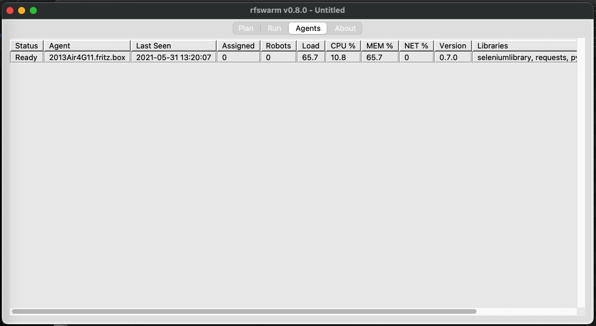

> _Agents - Running / Warning_ <br>
> 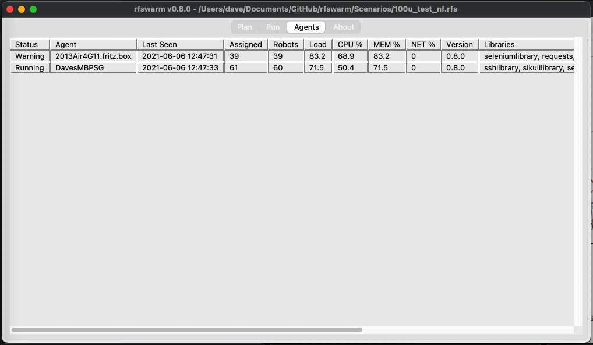

> _Agents - Stopping_ <br>
> 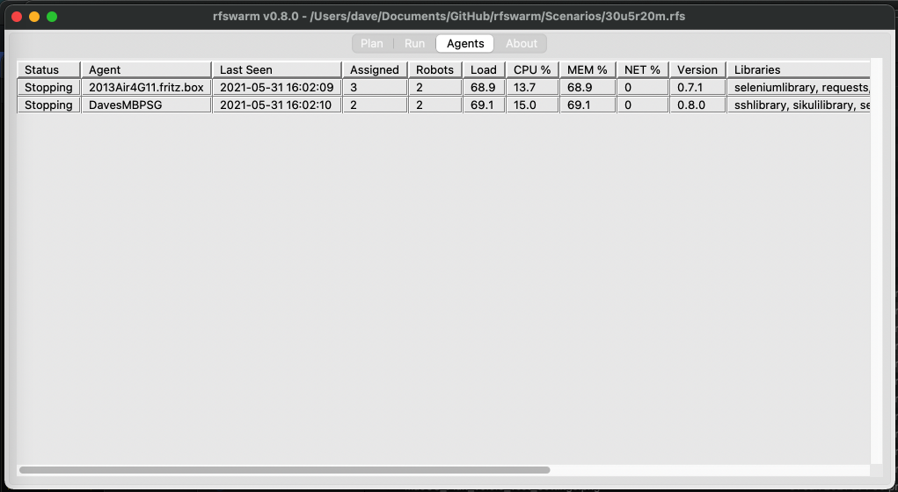

> _Agents - Running (Linux)_ <br>
> 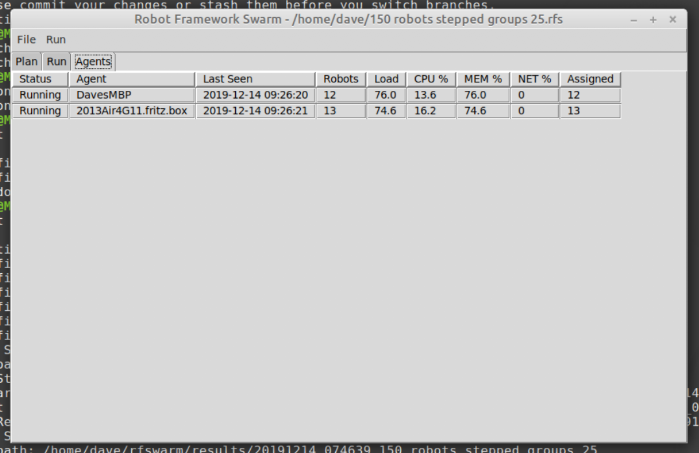

The columns for the agents screen
| Column Name	| Detail |
|---		|---	|
| Status	| This is the last status reported by the agent, unless a agent hasn't reported for a while, then this will show "Offline?". If the agent load is over 80% then status will be "Warning", and over 95% "Critical". All other status values are reported by the agent. |
| Agent		| This is the agent's name as reported by the agent, usually this is the agent's host name but this can be configured on the agent |
| Last Seen	| This is the time the last status update was received from the agent |
| Assigned	| This is the number of robots assigned to the agent during ramp up |
| Robots	| This is the number of robots that the agent reported as actually running at the last status update |
| Load		| This is the load value used by rfswarm to assign new robots to the agent with the lowest load, this value is the highest value of % CPU, % MEM and % NET |
| % CPU		| This is the current percentage of CPU usage as reported by the agents operating system |
| % MEM		| This is the current percentage of memory usage as reported by the agents operating system |
| % NET		| This is the current percentage of network usage as reported by the agents operating system |
| Version	| This is the rfswarm version number of the rfswarm agent |
| Libraries	| This is a list of robot framework libraries installed on the agent machine as reported by the python runtime that is running the agent (only python libraries that start with "robotframework-" are reported here |


#### About
This is where you can see the rfswarm manager version and links to the documentation as well as the donation links.

> _About_ <br>
> 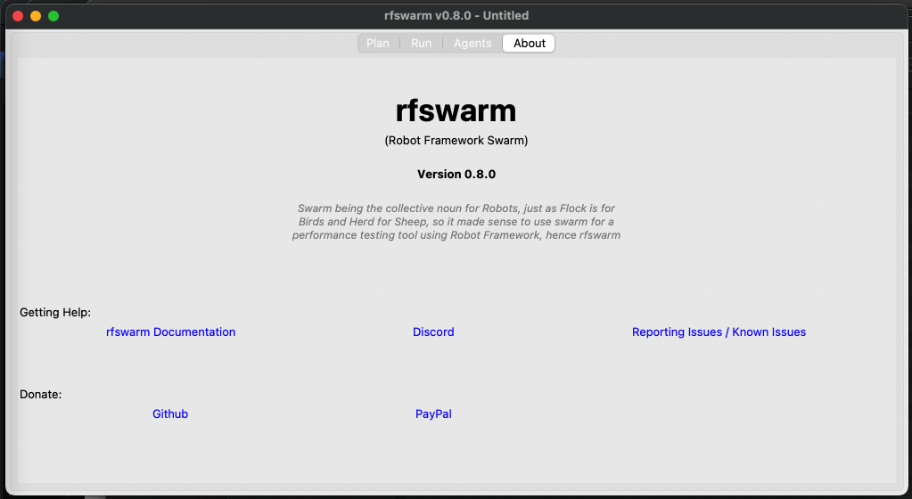

Clicking the links (blue text) will open the page in the default browser on you computer.


#### Graphs
New with version 0.8.0 is the ability to have live graphs during the test run displaying various data about the test.

You can access the graphs through the new Graphs menu
> _Graphs - Menu_ <br>
> 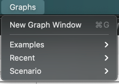

> _Graphs - Examples Menu_ <br>
> 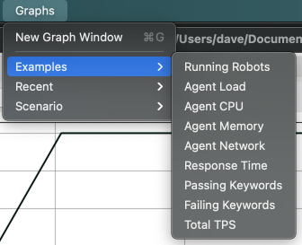

The Graphs menu has the following options
| Menu Option		| Detail |
|---				|---	|
| New Graph Window	| This option opens a new un-configured graph window with the settings showing so you can configure as you need, you can also use the shortcut key top open a new graph. |
| Examples			| Inside this menu is a list of preconfigured graphs, these will open with the settings closed as they are ready to use |
| Recent			| This menu is dynamically generated, it contains all the graphs that have been recently opened on this computer, if you select a graph from this menu that is already open then it will be brought to the front and gain focus, otherwise it will open the graph as it was when it was closed |
| Scenario			| This menu is dynamically generated, it contains all the graphs that were opened when the scenario was saved, if you select a graph from this menu that is already open then it will be brought to the front and gain focus, otherwise it will open the graph as it was when it was closed. If you save preconfigured graphs on one machine and then open the scenario on another machine these graphs will automatically open when you open the scenario and attempt to retain their position. |

> _Graphs - New Graph - Metric_ <br>
> 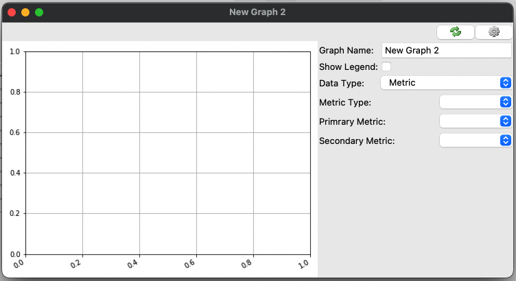

> _Graphs - New Graph - Result_ <br>
> 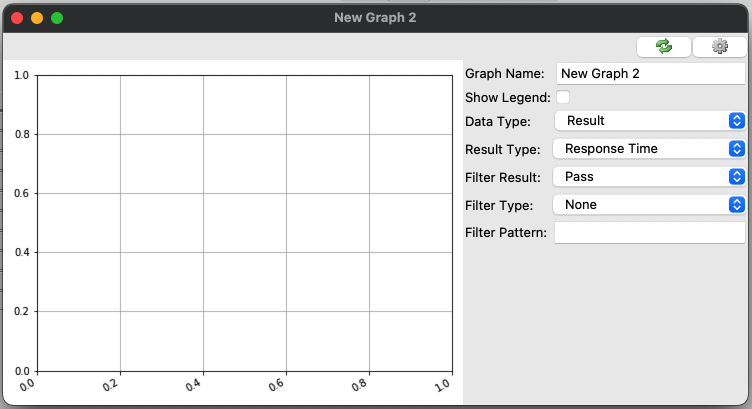

|	|	|	|
|---|---|---|
| Refresh	|			| Refresh the graph and the dynamic options in the graph configuration	|
| Settings	|		| Open an existing scenario	|

Common Settings:
| Setting	| Detail 	|
|---		|---		|
|Graph Name	| The name you want displayed on the title bar and in the graphs menus |
|Show Legend| Enable showing a legend at the bottom of the graph |
|Data Type	| Choose whether the data source is the results table or the metrics table |

Metric Settings:
| Setting	| Detail 	|
|---		|---		|
|Metric Type | Allows restricting results to specific types of metrics |
|Primary Metric| Allows restricting results by primary metric |
|Secondary Metric | Allows restricting results by secondary metric |

Results Settings:
| Setting	| Detail 	|
|---		|---		|
|Result Type | Results, TPS (transactions per second) or a Total TPS|
|Filter Result | Optionally restrict results to Pass or Fail |
|Filter Type | Determine if the filter pattern will limit results shown or restrict results from being shown |
|Filter Pattern | The pattern, using [glob patterns](https://www.sqlitetutorial.net/sqlite-glob/) |


Some of the example preconfigured graphs:

> _Graphs - Running Robots_ <br>
> 

> _Graphs - Agent Load_ <br>
> 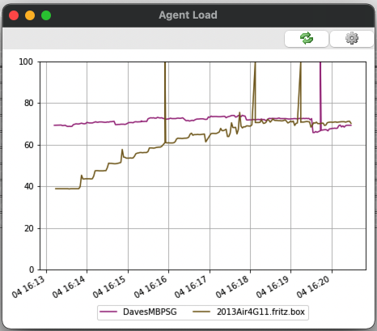

> _Graphs - Response Time_ <br>
> 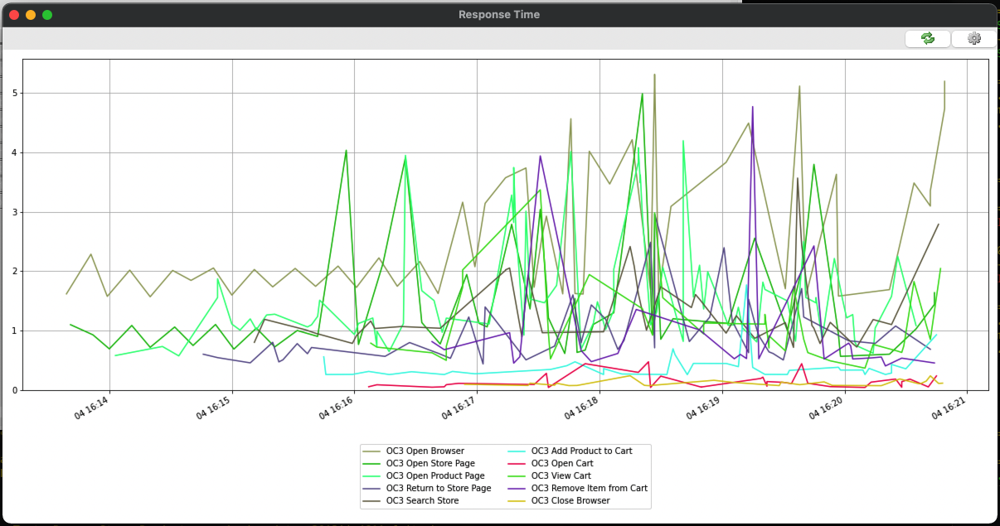


### Command Line Interface

These command line options allow you to override the ini file configuration but do not update the ini file.

Additionally the debug (-g) levels 1-3 will give extra information on the console useful for troubleshooting your environment. debug levels above 5 are more for debugging the code and get very noisy so are not recommended for normal use.

```
$ rfswarm -h
Robot Framework Swarm: Manager
	Version 1.0.0
usage: rfswarm.py [-h] [-g DEBUG] [-v] [-i INI] [-s SCENARIO] [-r] [-a AGENTS] [-n] [-t STARTTIME] [-d DIR] [-e IPADDRESS] [-p PORT]

optional arguments:
  -h, --help            show this help message and exit
  -g DEBUG, --debug DEBUG
                        Set debug level, default level is 0
  -v, --version         Display the version and exit
  -i INI, --ini INI     path to alternate ini file
  -s SCENARIO, --scenario SCENARIO
                        Load this scenario file
  -r, --run             Run the scenario automatically after loading
  -a AGENTS, --agents AGENTS
                        Wait for this many agents before starting (default 1)
  -n, --nogui           Don't display the GUI
  -t STARTTIME, --starttime STARTTIME
                        Specify the time to start the test HH:MM or HH:MM:SS (ISO 8601)
  -d DIR, --dir DIR     Results directory
  -e IPADDRESS, --ipaddress IPADDRESS
                        IP Address to bind the server to
  -p PORT, --port PORT  Port number to bind the server to
```

If you pass in an unsupported command line option, you will get this prompt:
```
$ rfswarm -?
Robot Framework Swarm: Manager
	Version 1.0.0
usage: rfswarm.py [-h] [-g DEBUG] [-v] [-i INI] [-s SCENARIO] [-r] [-a AGENTS] [-n] [-t STARTTIME] [-d DIR] [-e IPADDRESS] [-p PORT]
rfswarm: error: unrecognized arguments: -?
```

### Install and Setup

#### 1. Install
##### 1.1 Prerequisites
- The Manager machine needs to use a minimum of Python 3.7
> ThreadingHTTPServer feature of HTTPServer requires was added in Python 3.7

- tkinter may need to be installed, or it may already installed on your system, if it's not installed consult the [python documentation](https://tkdocs.com/tutorial/install.html) on how to install for your system.

On Debian based systems this will probably work
```
apt install python3-tk
```

##### 1.2 Install

Once you have the prerequisites sorted, the installation is simply
```
pip* install rfswarm-manager
```

\*some systems might need you to use pip3 and or sudo

#### 2. Adjust the Firewall

Check if there is a firewall on you Manager machine, if so you may need to adjust the firewall to add a rule to allow communication between the Manager and the Agent.

| Machine | Protocol | Port Number<sup>1</sup> | Direction |
|---|---|---|---|
| Manager | TCP | 8138 | Inbound |
| Agent | TCP | 8138 | Outbound |

<sup>1</sup> This is the default port number, replace with the port number you used if you changed it in the ini file or used the -p command line switch.

Most firewalls on servers and workstations don't require specific rules for outbound, so most likely you will only need to configure the Inbound rule on the Manager machine if it has a firewall.


#### 3. Run the Manager

```
rfswarm
```

#### 4. Manual Install the prerequisites

- The Manager machine needs to use a minimum of Python 3.7
> ThreadingHTTPServer feature of HTTPServer requires was added in Python 3.7

- tkinter may need to be installed, or it may already installed on your system, if it's not installed consult the [python documentation](https://tkdocs.com/tutorial/install.html) on how to install for your system.

On Debian based systems this will probably work
```
apt install python3-tk python3-pil python3-pil.imagetk
```

Additionally the following pip command might be needed if these are not already installed on your system:
```
pip* install configparser setuptools hashlib HTTPServer pillow matplotlib
```
> setuptools (is required by hashlib and HTTPServer)

\*some systems might need you to use pip3 and or sudo

#### 5. Manual Run the Manager

Use this method if you did not install using pip

```
python* rfswarm.py
```
\*or python3 on some systems


### Agent Assignment

As a result of experience with other load testing tools and difficulties in managing load generation machines, the agent assignment algorithm in rfswarm has been designed to switch modes to cater for several scenarios but not require manual intervention

The scenarios rfswarm has been designed to cater for:

1. Need to ensure each agent gets only 1 virtual user each
2. When there is a low number of virtual user, you want them distributed evenly across all the agents
3. When the agent machines are a variety of hardware (newer and older machines) you don't want the virtual user distributed evenly across all the agents, but rather you want the more powerful agents to take a larger share of the virtual users to avoid any agent getting overloaded.
4. Sometimes you need to apply a custom filter to Require/Exclude a test group to run on specific agents or groups of agents.

How the assignment algorithm works:
- As the scenario is ready to start the next virtual user the Manager calls the assignment algorithm
- First the agents are checked against the Agent Filter rules for the test group that is requiring an agent to be assigned, if the agent passes all the filter rules it is added to the list to be sorted.
- Next the assignment algorithm sorts the agents list by the number of virtual users assigned to each agent
- The agent with the lowest number of assigned virtual users is selected, there may be several agents with the equal lowest number of virtual users, e.g. at the start of the test all agents equally have zero (0) virtual users assigned, then the first agent from the list with this assigned count is selected.
- Before returning the selected agent the assigned virtual user count is checked to see if it is greater than 10, if not the selected agent is returned from the assignment algorithm.
- If the selected agent's assigned virtual user count is greater than 10, the selection is discarded and the assignment algorithm returns to the filtered agent list.
	- this time the agent list is sorted by the agent loads (See Load column in the screen shot of the agents tab above), where the load is simply the highest of the 3 monitored percentages (% CPU Usage, % Memory Consumption, % Network bandwidth usage)
	- the machine with the lowest load is selected and returned from the assignment algorithm.


### Credits

The icons used for the buttons in the Manager GUI were derived from the Creative Commons licensed (Silk icon set 1.3)[http://www.famfamfam.com/lab/icons/silk/]
