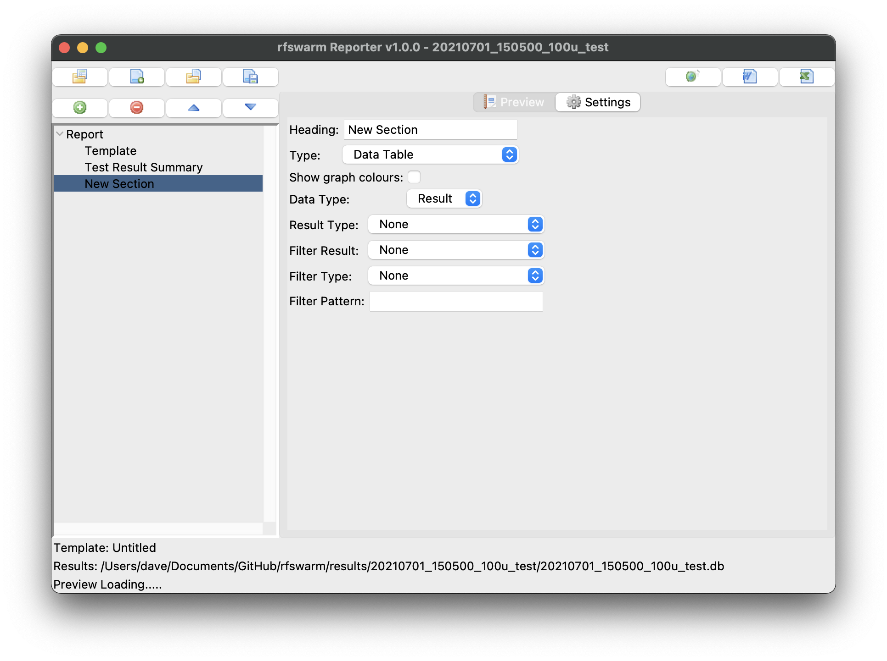

[Index](README.md)

## rfswarm Reporter

rfswarm Reporter is the reporting tool component, you would use this at some point after the performance test has completed.

- [User Interface](#User-Interface)
	- [Report Overview](#Report-Overview)
	- [Report Sections](#Report-Sections)
	- [Section Types](#Section-Types)
- [Command Line Interface](#Command-Line-Interface)
- [Install and Setup](#Install-and-Setup)
- [Credits](#Credits)

### User Interface

#### Report Overview

##### Report Preview


#### Report Sections


#### Section Types

##### Heading Section


##### Note Section


##### Contents Section


##### Data Graph Section


s


##### Data Table Section





### Command Line Interface

These command line options allow you to override the ini file configuration but do not update the ini file. The inclusion of the nogui option also allows for inclusion in CI/CD pipelines.

Additionally the debug (-g) levels 1-3 will give extra information on the console useful for troubleshooting your environment. debug levels above 5 are more for debugging the code and get very noisy so are not recommended for normal use.

```
$ rfswarm-reporter -h
Robot Framework Swarm: Reporter
	Version 1.0.0
usage: rfswarm_reporter.py [-h] [-g DEBUG] [-v] [-i INI] [-n] [-d DIR] [-t TEMPLATE] [--html] [--docx] [--xlsx]

optional arguments:
  -h, --help            show this help message and exit
  -g DEBUG, --debug DEBUG
                        Set debug level, default level is 0
  -v, --version         Display the version and exit
  -i INI, --ini INI     path to alternate ini file
  -n, --nogui           Don't display the GUI
  -d DIR, --dir DIR     Results directory
  -t TEMPLATE, --template TEMPLATE
                        Specify the template
  --html                Generate a HTML report
  --docx                Generate a MS Word report
  --xlsx                Generate a MS Excel report
```

If you pass in an unsupported command line option, you will get this prompt:
```
$ rfswarm-reporter -?
Robot Framework Swarm: Reporter
	Version 1.0.0
usage: rfswarm_reporter.py [-h] [-g DEBUG] [-v] [-i INI] [-n] [-d DIR] [-t TEMPLATE] [--html] [--docx] [--xlsx]
rfswarm-reporter: error: unrecognized arguments: -?
```

### Install and Setup

#### 1. Install
##### 1.1 Prerequisites
- The Reporter machine needs to use a minimum of Python 3.9
- tkinter may need to be installed, or it may already installed on your system, if it's not installed consult the [python documentation](https://tkdocs.com/tutorial/install.html) on how to install for your system.

On Debian based systems this will probably work
```
apt install python3-tk
```

##### 1.2 Install

Once you have the prerequisites sorted, the installation is simply
```
pip* install rfswarm-reporter
```

\*some systems might need you to use pip3 and or sudo


#### 3. Run the Reporter

```
rfswarm-reporter
```

#### 4. Manual Install the prerequisites

- The Manager machine needs to use a minimum of Python 3.9
- tkinter may need to be installed, or it may already installed on your system, if it's not installed consult the [python documentation](https://tkdocs.com/tutorial/install.html) on how to install for your system.

On Debian based systems this will probably work
```
apt install python3-tk
```

Additionally the following pip command might be needed if these are not already installed on your system:
```
pip* install configparser pillow matplotlib python-docx openpyxl tzlocal>=4.1
```

\*some systems might need you to use pip3 and or sudo

#### 5. Manual Run the Manager

Use this method if you did not install using pip

```
python* rfswarm_reporter.py
```
\*or python3 on some systems


### Credits

The icons used for the buttons in the Manager GUI were derived from the Creative Commons licensed (Silk icon set 1.3)[http://www.famfamfam.com/lab/icons/silk/]
