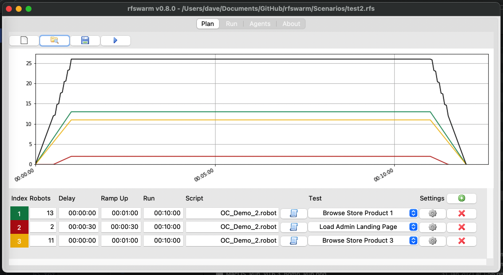
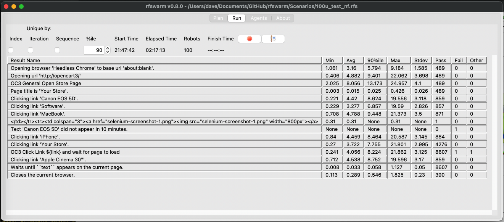
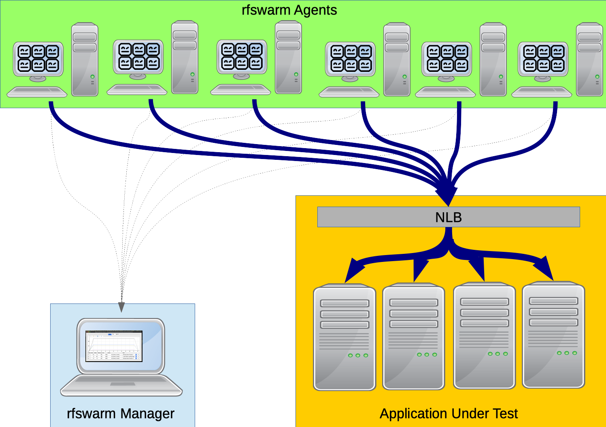

# rfswarm (Robot Framework Swarm)

|Version|Manager|Agent|Reporter|
|---|---|---|---|
| |  |  |  |

| Build Status |
| -- |
|  |
|  |

## About
rfswarm is a testing tool that allows you to use [Robot Framework](https://robotframework.org/) test cases for performance or load testing.

> _Swarm being the collective noun for Robots, just as Flock is for Birds and Herd for Sheep, so it made sense to use swarm for a performance testing tool using Robot Framework, hence rfswarm_

While Robot Framework is normally used for functional or regression testing, it has long been considered the holy grail in testing for there to be synergies between the functional and performance testing scripts so that effort expended in creating test cases for one does not need to be duplicated for the other which is currently the normal case.

rfswarm aims to solve this problem by allowing you to take an existing functional or regression test case written in Robot Framework, make some minor adjustments to make the test case suitable for performance testing and then run the Robot Framework test case with as many virtual users (robots) as needed to generate load on the application under test.

rfswarm is written completely in python, so if you are already using Robot Framework, then you will already have most of what you need to use rfswarm and will be familiar with pip to get any extra components you need.

To learn more about rfswarm please refer to the [Documentation](Doc/README.md)

## Getting Help

### Community Support

- [rfswarm Documentation](Doc/README.md)
- [Discord](https://discord.gg/jJfCMrqCsT)
- [Slack](https://robotframework.slack.com/archives/C06J2Q0LGEM)
- [Reporting Issues / Known Issues](https://github.com/damies13/rfswarm/issues)

<kbd align="centre">

</kbd> 
An example of how your rfswarm setup might look.

### Commercial Support
- The easiest way to get commercial support is to sponsor this project on [GitHub](https://github.com/sponsors/damies13?frequency=recurring&sponsor=damies13)

### Contribute
If you'd like to help make rfswarm better the are a number of ways you can help (only the last two require programming skills)
- Update the Documentation, all the documentation is written in Markdown (GitHub flavour) so is very easy to update but time consuming so help with this will be very appreciated
- Testing
  - Automated testing, With v1.1.0 GitHub Actions were setup to run robotframework test cases from the [Tests/Regression](Tests/Regression) folder of this repository, the tests can be either command-line tests or GUI tests using ImageHorizonLibrary, and the tests will run on Windows-latest, macos-latest & ubuntu-latest for all supported versions of python.
  The initial set of tests are very basic but gives a start point, contributing test cases will help make future versions of rfswarm more reliable and will be greatly appreciated.
  - Manual testing, any testing that finds bugs is appreciated, but manual testing is not reliably repeatable so automation is preferred
- Raise an Issue, yes finding a but is helpful!
- Create a Feature Request, if you have an idea you think will make rfswarm better, please let us know.
- Add a reaction to or comment on an Issue (especially Bugs and Feature Requests), adding a :+1: tells us you want this implemented too, and a :-1: lets us know you think it's a bad idea (please add a comment to for why). this will help for prioritising which issues get implemented next.
- Fix a bug, please assign the issue to you self or add a comment on the issue first, to prevent duplication of effort.
- Implement a Feature Request, please assign the issue to you self or add a comment on the issue first, to prevent duplication of effort.

## Donations

If you would like to thank me for this project please consider using one of the sponsorship methods:
- [GitHub](https://github.com/sponsors/damies13?frequency=one-time&sponsor=damies13)
- [PayPal.me](https://paypal.me/damies13/5) (the $5 is a suggestion, feel free to change to any amount you would like)

[See our sponsors](Doc/Sponsors.md)
