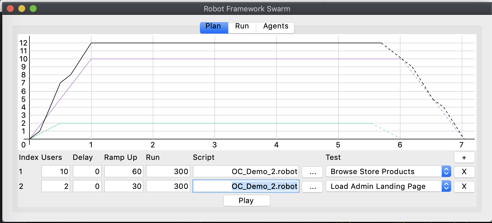
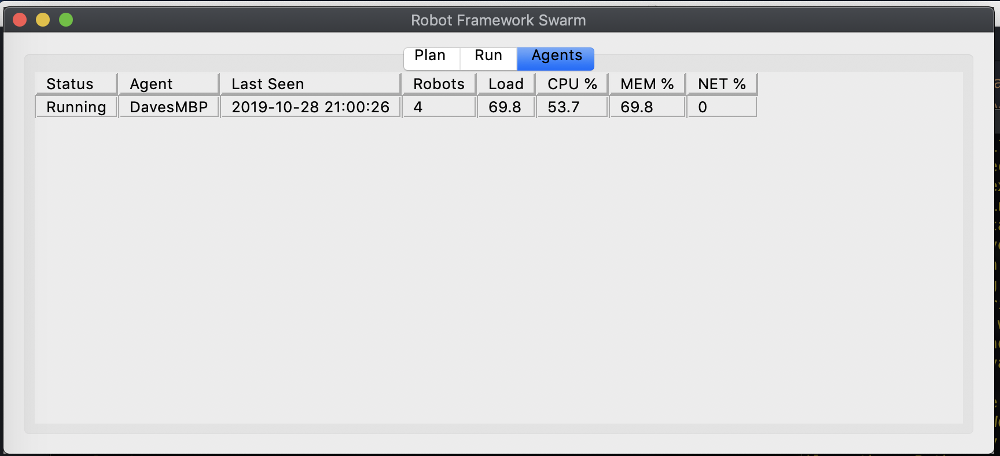

# rfswarm (Robot Framework Swarm)

## About
rfswarm is a testing tool that allows you use [Robot Framework](https://robotframework.org/) test cases for performance or load testing.

While Robot Framework is normally used for functional or regression testing, it has long been considered the holy grail in testing for there to be synergies between the functional and performance testing scripts so that effort expended in creating test cases for one does not need to be duplicated for the other which is currently the normal case.

rfswarm aims to solve this problem by allowing you to take an existing functional or regression test case written in Robot Framework, make some minor adjustments to make the test case suitable for performance testing and then run the Robot Framework test case as many virtual users to generate load on the application under test.

rfswarm is written completely in python, so if you are already using Robot Framework, then you will already have most of what you need to use rfswarm and will be familiar with pip to get any extra components you need.

## rfswarm.py (GUI / Server)

rfswarm.py is the GUI and central component of rfswarm, this is where you plan, execute and monitor your performance test.

Some screen shots below of rfswarm in action:
##### Plan - This is where you construct your test scenario, choose your test cases and number of virtual users

##### Run - This is where you monitor your test scenario as it runs, here you will see number of robots running, how long the has been running and live updates of the test results

##### Run - This is where you can see which agents have connected, number of robots on each agent and monitor the performance of the agents

## rfswarm_agent.py (Agent)

rfswarm_agent.py is the agent component that actually runs the Robot Framework test cases and returns the results to rfswarm. The agent has no GUI
